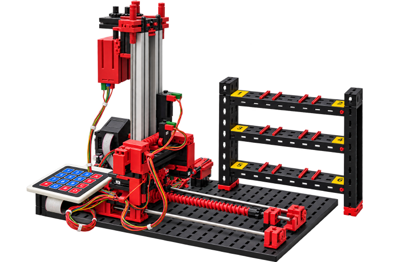

# fischertechnik Hochregallager mit ftDuino

Programme, Dokumentationen und weitere Unterlagen zu meinem fischertechnik Hochregallager mit ftDuino-Steuerung.

## Projektbeschreibung
Die hier vorgestellte Variante des fischertechnik Hochregallagers wird mit einem **ftDuino-Controller** gesteuert. An dessen I²C-Port werden eine **4×4-Matrixtastatur** und ein **0,96"-OLED-Display** betrieben.

Gegenüber dem Original ergeben sich dadurch folgende Vorteile:

* kostengünstige Steuerungshardware
* Programmierung auf Basis von C++ bzw. C
* menügeführte Bedienung
* vom Computer unabhängiger Betrieb

## Hardware
Der mechanische Aufbau und die grundlegende Verdrahtung des Hochregallagers erfolgen entsprechend der fischertechnik Bauanleitung „ROBO TX Automation Robots“.

Die im Video verwendete
[Hardware-Erweiterung](https://github.com/HR-Projekte/ft-Hochregallager-und-ft-3-Achs-Roboter/blob/main/Bilder/I2C-Konfiguration.jpg?raw=true) und Schaltplan.  
Optionale Ergänzung:
[Hardware Option](https://github.com/HR-Projekte/ft-Hochregallager-und-ft-3-Achs-Roboter/blob/main/Bilder/Hardware-option.jpg)  
und die stl-Datei für das
[Keypad_70x78](https://raw.githubusercontent.com/HR-Projekte/ft-Hochregallager-und-ft-3-Achs-Roboter/main/3D-Druck/Keypad_70x78.stl) zum Download.

Eine billigere 
[I2C-Alternative](https://github.com/HR-Projekte/ft-Hochregallager-und-ft-3-Achs-Roboter/blob/main/Bilder/I2C-alternativ.jpg)

## Stücklisten
Bauteile für das Hochregallager ohne Steuerung:
[Einzelteile-Grundmaschine](Stücklisten/Einzelteile-Grundmaschine.pdf)  
Bauteile für die Steuerung
[Einzelteile-Steuerung](https://github.com/HR-Projekte/ft-Hochregallager-und-ft-3-Achs-Roboter/blob/main/Stücklisten/Einzelteile-Steuerung.pdf)

## Schltpläne

## Software
Das Steuerungsprogramm für das Hochregallager ist als Arduino-Sketch abgelegt.  
[Arduino-Programm Hochregallager](Programme/Hochregallager/)

## Dokumentation
Ein Flussdiagramm zur 
[Menüstruktur](https://github.com/HR-Projekte/ft-Hochregallager-und-ft-3-Achs-Roboter/blob/main/Dokumentation/Menue-Ablauf.pdf)

## Videos
